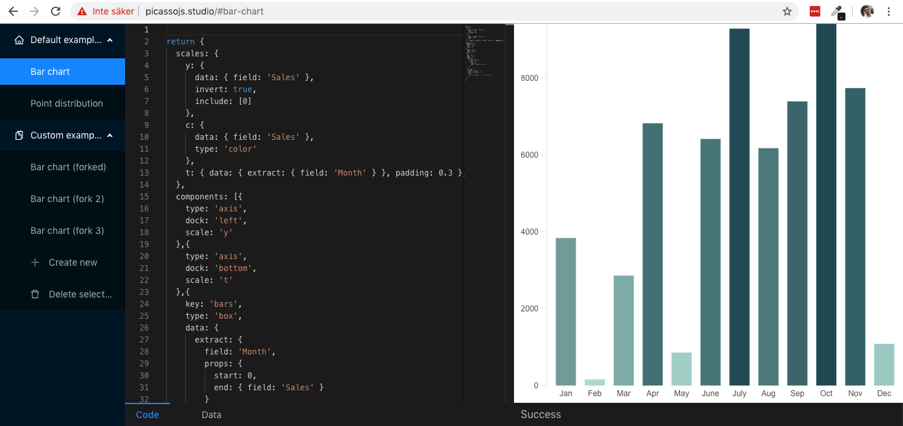

# [picassojs.studio](https://picassojs.studio) 
The picassojs.studio website is a custom code playground/sandbox for creating visualizations using [the picasso.js visualization framework](https://picassojs.com) - it's inspired by an internal tool, picasso-sandbox, that I created while we developed picasso.js.

It's real time and updates itself, designed to streamline how to create graphs. It has a Code tab and a Data tab. The result of the "Code" tab is passed to picasso.js as the "settings", and the result of the "data" tab is passed into picasso.js as the "data". 

### How do i use this locally?
1. Clone the repo
2. Run `yarn && yarn start`
3. Have fun!

### Can i use a linked version of picasso.js?
This SHOULD work - however I can't seem to get yarn to run right now, so I can't confirm it. Here's the steps:
1. Clone the `picasso.js` repo and follow installation instructions
2. Navigate to the picasso.js package using `cd packages/picasso.js`
3. Run `npm run build:watch`
4. Do `npm link`
5. In the `picassojs-studio`-repo, run `npm link picasso.js`

### Is this related to picasso.js?
No. This is purely a free-time/hobby kind of thing, 
and is not endorsed nor supported by the picasso.js 
team.

### How are the examples hosted?
Locally only, in your localStorage

### Can I import/export examples?
Not yet. Or well, if you fiddle about with your
localStorage, you can edit it using an editor,
and then paste it back again and reload the page.
But no, other then that there's no official way.
